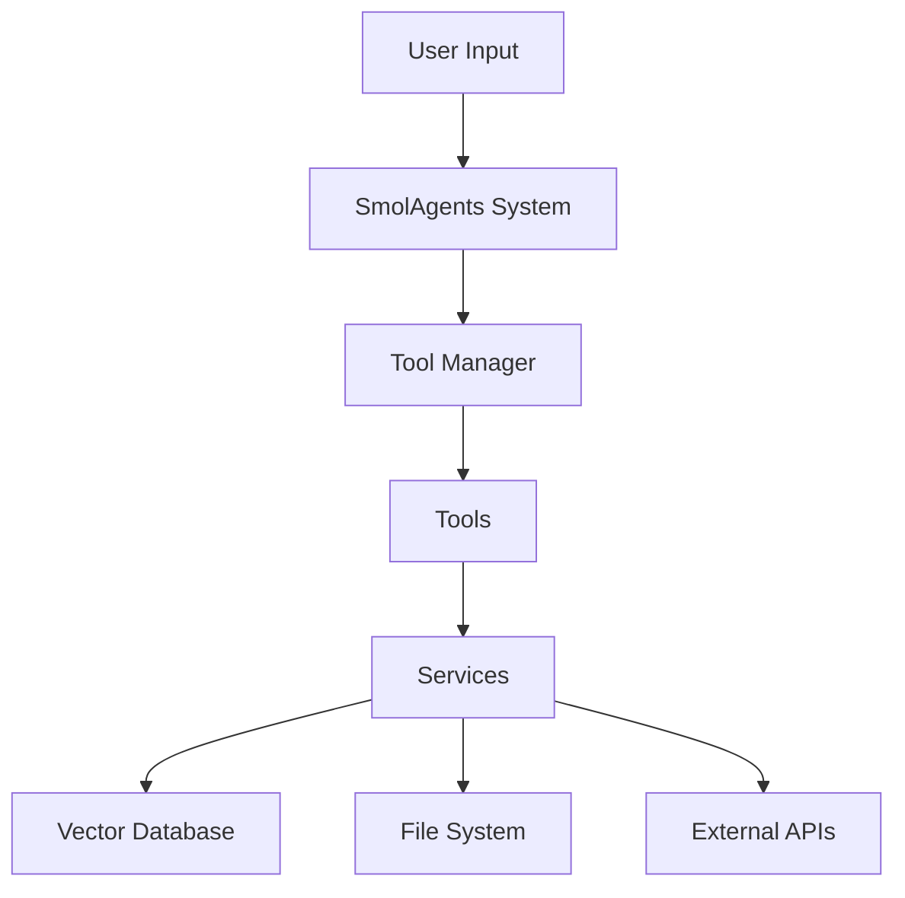

# DiscoSui Architecture Overview

## System Architecture

DiscoSui follows a modular architecture designed to provide seamless integration with Obsidian while maintaining high performance and extensibility.

### Core Components

1. **Backend Service (FastAPI)**
   - Handles all business logic and data processing
   - Provides RESTful API endpoints
   - Manages SmolAgents and tool execution
   - Implements RAG (Retrieval Augmented Generation)

2. **SmolAgents System**
   - Manages AI agents and their interactions
   - Handles natural language processing
   - Executes tools based on user requests
   - Maintains conversation context

3. **Tool Manager**
   - Routes requests to appropriate tools
   - Manages tool dependencies
   - Handles tool execution errors
   - Provides tool registry and metadata

4. **Vector Database**
   - Stores note embeddings for RAG
   - Enables semantic search
   - Maintains metadata for efficient retrieval
   - Supports multiple vector database backends

### Service Architecture

## Data Flow

1. **User Input Processing**
   - Natural language input received
   - Intent analysis performed
   - Request routed to appropriate tool

2. **Tool Execution**
   - Tool dependencies checked
   - Required services initialized
   - Operation executed
   - Results processed

3. **Data Storage**
   - Notes stored in Obsidian vault
   - Embeddings stored in vector database
   - Metadata maintained for efficient retrieval

## Security Architecture

1. **Authentication**
   - API key validation
   - Token-based authentication
   - Session management

2. **Authorization**
   - Role-based access control
   - Resource-level permissions
   - Action-level restrictions

3. **Data Protection**
   - Encryption at rest
   - Secure communication channels
   - API key management

## Performance Considerations

1. **Caching Strategy**
   - In-memory caching for frequently accessed data
   - Result caching for expensive operations
   - Cache invalidation policies

2. **Optimization Techniques**
   - Batch processing for large operations
   - Asynchronous task execution
   - Resource pooling

3. **Scalability**
   - Horizontal scaling support
   - Load balancing
   - Resource management

## Error Handling

1. **Error Categories**
   - Tool execution errors
   - Service errors
   - External API errors
   - File system errors

2. **Recovery Mechanisms**
   - Automatic retries
   - Fallback strategies
   - Error reporting

3. **Monitoring**
   - Error logging
   - Performance metrics
   - System health checks

## Integration Points

1. **Obsidian Integration**
   - File system operations
   - Note template management
   - Vault structure maintenance

2. **External Services**
   - LLM API integration
   - Email service integration
   - Audio processing service

3. **Vector Database**
   - Multiple backend support
   - Embedding generation
   - Similarity search

## Development Guidelines

1. **Code Organization**
   - Modular architecture
   - Clear separation of concerns
   - Consistent file structure

2. **Testing Strategy**
   - Unit testing
   - Integration testing
   - End-to-end testing

3. **Documentation**
   - API documentation
   - Architecture documentation
   - Service documentation

## Deployment Architecture

1. **Container Architecture**
   - Docker containers
   - Service orchestration
   - Resource management

2. **Environment Management**
   - Configuration management
   - Environment variables
   - Secrets management

3. **Monitoring and Logging**
   - Log aggregation
   - Metrics collection
   - Alert management
