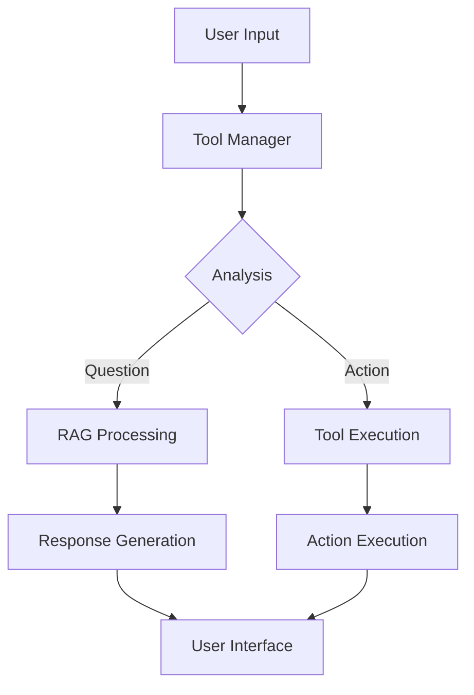
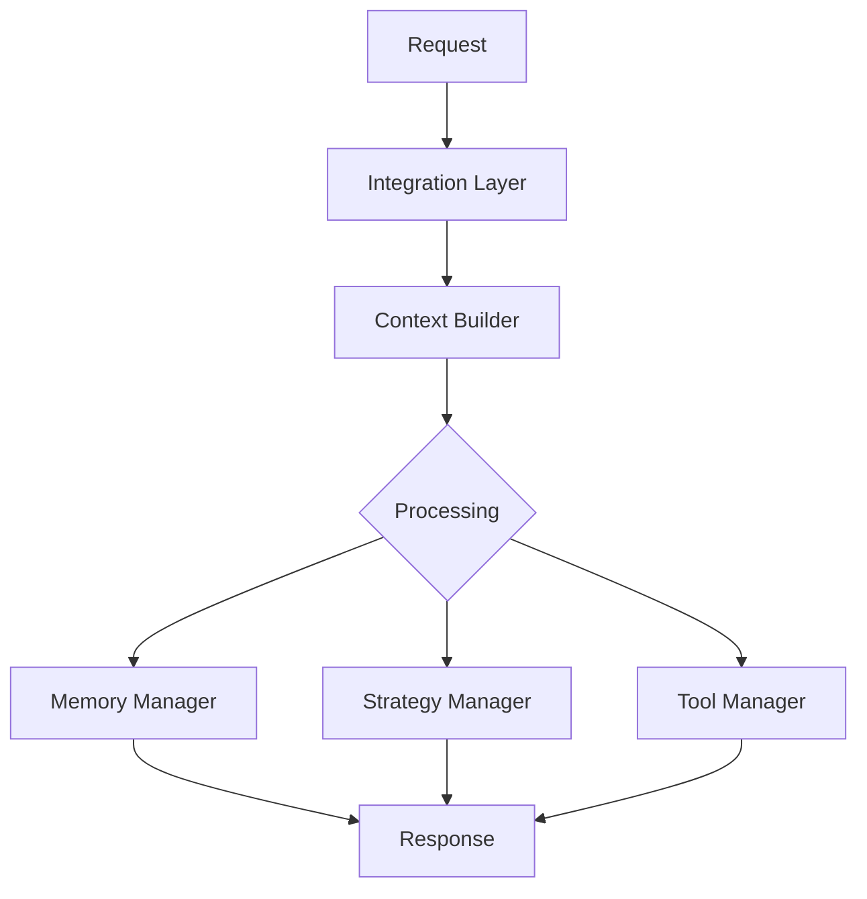
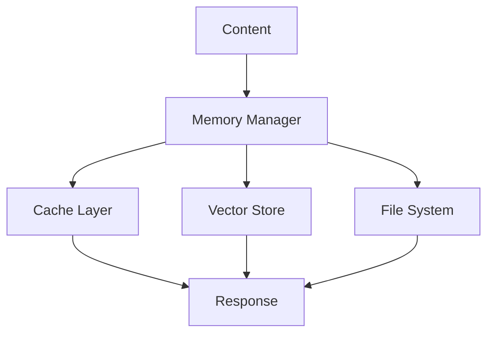
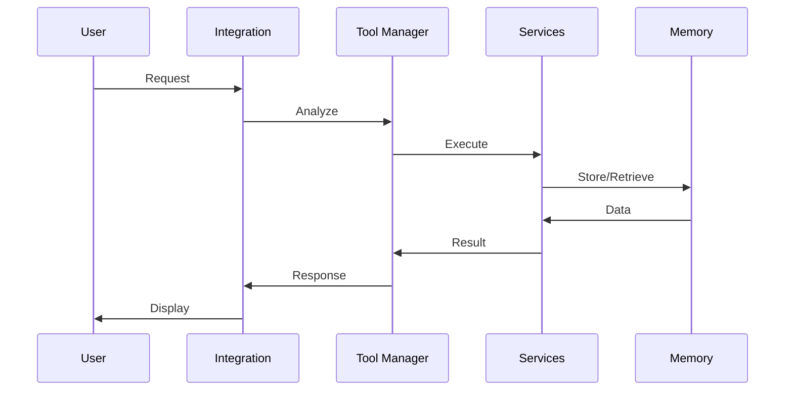
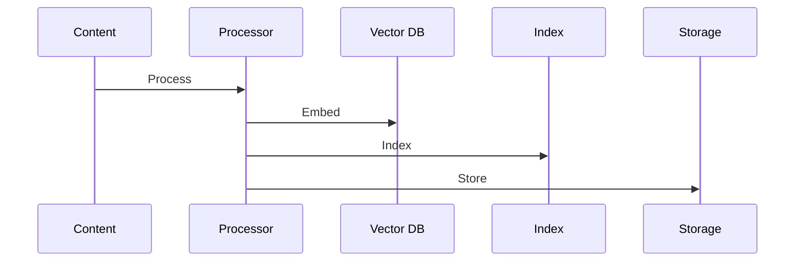
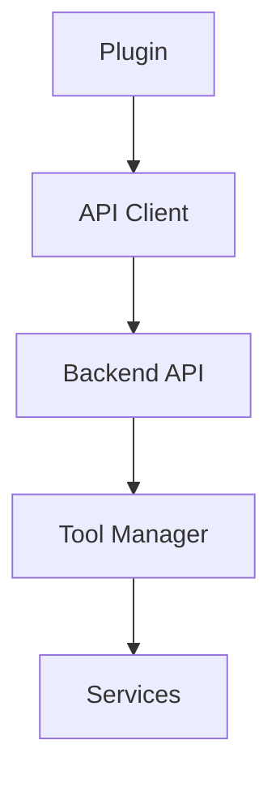

# DiscoSui Architecture Guide

## Overview

DiscoSui follows a modular, service-oriented architecture designed for extensibility and maintainability. The system is built around the smolagents framework and follows a clear separation of concerns.

## Core Components

### 1. Tool Manager


- **Purpose**: Routes user requests to appropriate tools
- **Location**: `backend/src/core/tool_manager.py`
- **Key Features**:
  - Request analysis
  - Tool selection
  - Execution management
  - Error handling

### 2. Integration Layer


- **Purpose**: Manages request processing and integration
- **Location**: `backend/src/core/integration.py`
- **Components**:
  - Context management
  - Error handling
  - Request processing
  - Response formatting

### 3. Memory System


- **Purpose**: Manages content storage and retrieval
- **Location**: `backend/src/core/memory.py`
- **Features**:
  - Caching
  - Vector storage
  - File management
  - Content indexing

## Service Architecture

### 1. Core Services
- **Content Processing**
  - Text analysis
  - Content manipulation
  - Format conversion
- **Note Management**
  - Creation/deletion
  - Organization
  - Template handling
- **Search Services**
  - Full-text search
  - Semantic search
  - Tag-based search

### 2. Extension Services
- **Audio Processing**
  - Transcription
  - Analysis
  - Integration
- **Email Processing**
  - Parsing
  - Integration
  - Organization
- **Knowledge Graph**
  - Relationship tracking
  - Graph generation
  - Analysis

## Tool System

### 1. Base Tools
```python
class BaseTool:
    """Base interface for all tools."""
    async def forward(self, **kwargs) -> Dict[str, Any]:
        pass
```

### 2. Tool Categories
- Content Tools
- Analysis Tools
- Organization Tools
- Service Tools

### 3. Tool Registration
```python
@dataclass
class ToolMetadata:
    name: str
    category: str
    description: str
    version: str = "1.0.0"
```

## Data Flow

### 1. Request Processing


### 2. Content Processing


## Plugin Architecture

### 1. Components
- Chat Interface
- Command System
- Event Handlers
- State Management

### 2. Integration


## Security

### 1. Authentication
- API key management
- Token-based auth
- Session handling

### 2. Authorization
- Permission system
- Role-based access
- Resource limits

## Error Handling

### 1. Error Types
```python
class ToolError(Exception): pass
class RAGError(Exception): pass
class IntegrationError(Exception): pass
```

### 2. Recovery Strategies
- Retry mechanisms
- Fallback options
- User notifications

## Performance Optimization

### 1. Caching
- Memory cache
- Disk cache
- Vector cache

### 2. Batch Processing
- Request batching
- Bulk operations
- Background tasks

## Development Guidelines

### 1. Code Structure
- Follow modular design
- Use type hints
- Write comprehensive tests
- Document all components

### 2. Best Practices
- Follow PEP 8
- Use async/await
- Handle errors properly
- Write clear documentation

### 3. Testing
- Unit tests
- Integration tests
- End-to-end tests
- Performance tests

## Deployment

### 1. Components
- Backend server
- Vector database
- File storage
- Cache system

### 2. Configuration
- Environment variables
- Service configuration
- Plugin settings
- Logging setup

## Monitoring

### 1. Metrics
- Request latency
- Error rates
- Resource usage
- Cache hit rates

### 2. Logging
- Application logs
- Error logs
- Access logs
- Performance logs

For more detailed information about specific components, refer to their respective documentation in the `docs/` directory. 