# DiscoSui Application Flows

This document provides visual representations of the various flows within the DiscoSui application using Mermaid diagrams.

## Main Application Flows

### Flow 1: Plain Question Answering Flow

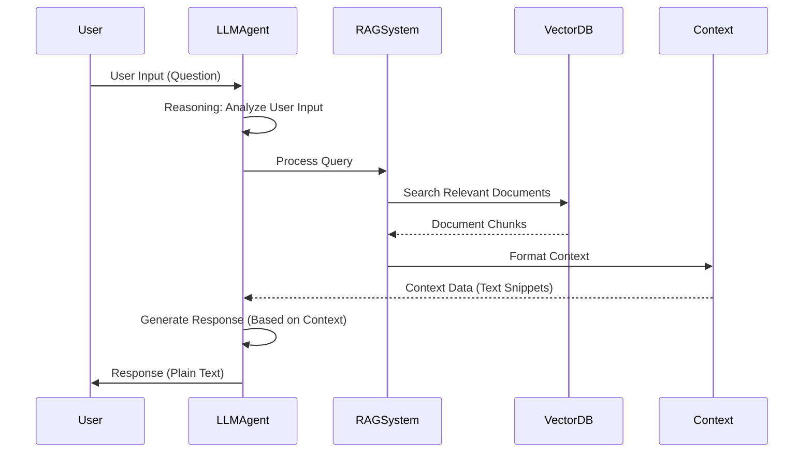
```mermaid
sequenceDiagram
    participant User
    participant LLMAgent
    participant RAGSystem
    participant VectorDB
    participant Context
    
    User->>LLMAgent: User Input (Question)
    LLMAgent->>LLMAgent: Reasoning: Analyze User Input
    LLMAgent->>RAGSystem: Process Query
    RAGSystem->>VectorDB: Search Relevant Documents
    VectorDB-->>RAGSystem: Document Chunks
    RAGSystem->>Context: Format Context
    Context-->>LLMAgent: Context Data (Text Snippets)
    LLMAgent->>LLMAgent: Generate Response (Based on Context)
    LLMAgent->>User: Response (Plain Text)
```

### Flow 2: Semantic Notes Access and Editing Flow

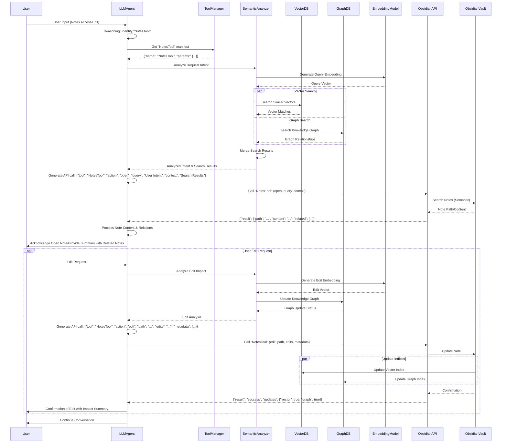
```mermaid
sequenceDiagram
    participant User
    participant LLMAgent
    participant ToolManager
    participant SemanticAnalyzer
    participant VectorDB
    participant GraphDB
    participant EmbeddingModel
    participant ObsidianAPI
    participant ObsidianVault
    
    User->>LLMAgent: User Input (Notes Access/Edit)
    LLMAgent->>LLMAgent: Reasoning: Identify "NotesTool"
    LLMAgent->>ToolManager: Get "NotesTool" manifest
    ToolManager-->>LLMAgent: {"name": "NotesTool", "params": {...}}
    
    %% Semantic Analysis and Search
    LLMAgent->>SemanticAnalyzer: Analyze Request Intent
    SemanticAnalyzer->>EmbeddingModel: Generate Query Embedding
    EmbeddingModel-->>SemanticAnalyzer: Query Vector
    
    par Vector Search
        SemanticAnalyzer->>VectorDB: Search Similar Vectors
        VectorDB-->>SemanticAnalyzer: Vector Matches
    and Graph Search
        SemanticAnalyzer->>GraphDB: Search Knowledge Graph
        GraphDB-->>SemanticAnalyzer: Graph Relationships
    end
    
    SemanticAnalyzer->>SemanticAnalyzer: Merge Search Results
    SemanticAnalyzer-->>LLMAgent: Analyzed Intent & Search Results
    
    LLMAgent->>LLMAgent: Generate API call: {"tool": "NotesTool", "action": "open", "query": "User Intent", "context": "Search Results"}
    LLMAgent->>ObsidianAPI: Call "NotesTool" (open, query, context)
    ObsidianAPI->>ObsidianVault: Search Notes (Semantic)
    ObsidianVault-->>ObsidianAPI: Note Path/Content
    ObsidianAPI-->>LLMAgent: {"result": {"path": "...", "content": "...", "related": [...]}}
    
    LLMAgent->>LLMAgent: Process Note Content & Relations
    LLMAgent->>User: Acknowledge Open Note/Provide Summary with Related Notes
    
    opt User Edit Request
        User->>LLMAgent: Edit Request
        LLMAgent->>SemanticAnalyzer: Analyze Edit Impact
        SemanticAnalyzer->>EmbeddingModel: Generate Edit Embedding
        EmbeddingModel-->>SemanticAnalyzer: Edit Vector
        SemanticAnalyzer->>GraphDB: Update Knowledge Graph
        GraphDB-->>SemanticAnalyzer: Graph Update Status
        SemanticAnalyzer-->>LLMAgent: Edit Analysis
        
        LLMAgent->>LLMAgent: Generate API call: {"tool": "NotesTool", "action": "edit", "path": "...", "edits": "...", "metadata": {...}}
        LLMAgent->>ObsidianAPI: Call "NotesTool" (edit, path, edits, metadata)
        ObsidianAPI->>ObsidianVault: Update Note
        
        par Update Indices
            ObsidianVault->>VectorDB: Update Vector Index
            ObsidianVault->>GraphDB: Update Graph Index
        end
        
        ObsidianVault-->>ObsidianAPI: Confirmation
        ObsidianAPI-->>LLMAgent: {"result": "success", "updates": {"vector": true, "graph": true}}
        LLMAgent->>User: Confirmation of Edit with Impact Summary
    end
    
    LLMAgent->>User: Continue Conversation
```

### Flow 3: Web Search for Note Enrichment Flow

```mermaid
sequenceDiagram
    participant User
    participant LLMAgent
    participant ToolManager
    participant WebSearchAPI
    participant ContentProcessor
    participant ObsidianAPI
    participant ObsidianVault
    
    User->>LLMAgent: User Input (Note Enrichment/Creation)
    LLMAgent->>LLMAgent: Reasoning: Identify "WebSearchTool"
    LLMAgent->>ToolManager: Get "WebSearchTool" manifest
    ToolManager-->>LLMAgent: {"name": "WebSearchTool", "params": {...}}
    LLMAgent->>LLMAgent: Generate API call: {"tool": "WebSearchTool", "query": "Relevant Query"}
    LLMAgent->>WebSearchAPI: Call "WebSearchTool" (query)
    WebSearchAPI-->>LLMAgent: {"results": [{"title": "...", "snippet": "...", "url": "..."}, ...]}
    LLMAgent->>ContentProcessor: Process Search Results
    ContentProcessor-->>LLMAgent: Processed Content
    
    opt Note Enrichment
        LLMAgent->>LLMAgent: Generate API call: {"tool": "NotesTool", "action": "enrich", "path": "...", "context": "..."}
        LLMAgent->>ObsidianAPI: Call "NotesTool" (enrich, path, context)
        ObsidianAPI->>ObsidianVault: Update Note
        ObsidianVault-->>ObsidianAPI: Confirmation
        ObsidianAPI-->>LLMAgent: {"result": "success"}
        LLMAgent->>User: Confirmation of Note Enrichment
    else Note Creation
        LLMAgent->>LLMAgent: Generate API call: {"tool": "NotesTool", "action": "create", "title": "...", "content": "..."}
        LLMAgent->>ObsidianAPI: Call "NotesTool" (create, title, content)
        ObsidianAPI->>ObsidianVault: Create Note
        ObsidianVault-->>ObsidianAPI: Confirmation
        ObsidianAPI-->>LLMAgent: {"result": {"path": "..."}}
        LLMAgent->>User: Confirmation of New Note Creation
    end
    
    LLMAgent->>User: Continue Conversation
```

### Flow 4: Vault Reorganization Flow

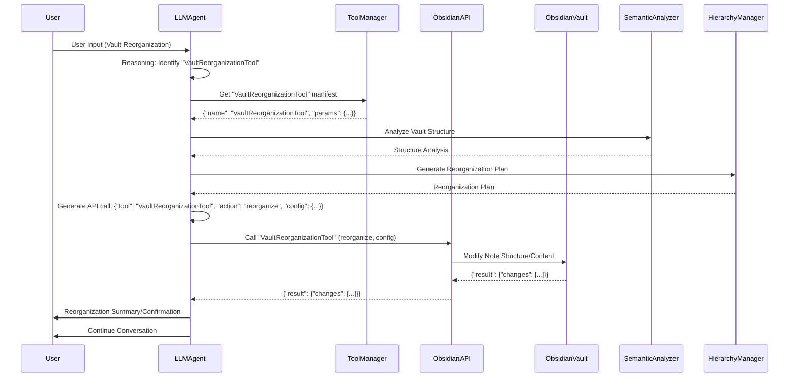
```mermaid
sequenceDiagram
    participant User
    participant LLMAgent
    participant ToolManager
    participant ObsidianAPI
    participant ObsidianVault
    participant SemanticAnalyzer
    participant HierarchyManager
    
    User->>LLMAgent: User Input (Vault Reorganization)
    LLMAgent->>LLMAgent: Reasoning: Identify "VaultReorganizationTool"
    LLMAgent->>ToolManager: Get "VaultReorganizationTool" manifest
    ToolManager-->>LLMAgent: {"name": "VaultReorganizationTool", "params": {...}}
    LLMAgent->>SemanticAnalyzer: Analyze Vault Structure
    SemanticAnalyzer-->>LLMAgent: Structure Analysis
    LLMAgent->>HierarchyManager: Generate Reorganization Plan
    HierarchyManager-->>LLMAgent: Reorganization Plan
    LLMAgent->>LLMAgent: Generate API call: {"tool": "VaultReorganizationTool", "action": "reorganize", "config": {...}}
    LLMAgent->>ObsidianAPI: Call "VaultReorganizationTool" (reorganize, config)
    ObsidianAPI->>ObsidianVault: Modify Note Structure/Content
    ObsidianVault-->>ObsidianAPI: {"result": {"changes": [...]}}
    ObsidianAPI-->>LLMAgent: {"result": {"changes": [...]}}
    LLMAgent->>User: Reorganization Summary/Confirmation
    LLMAgent->>User: Continue Conversation
```

### Flow 5: Service Execution Flow (Audio Transcription, Email Parsing)

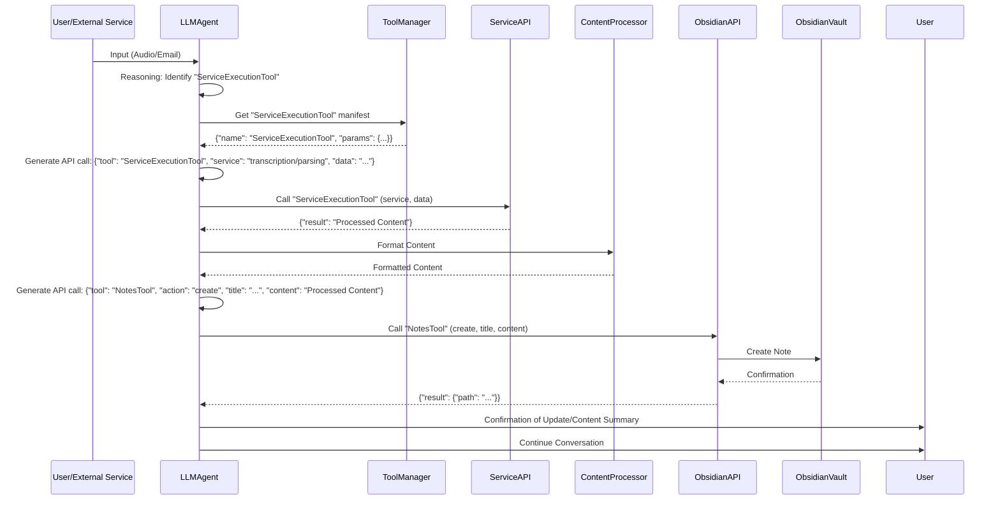
```mermaid
sequenceDiagram
    participant User/External Service
    participant LLMAgent
    participant ToolManager
    participant ServiceAPI
    participant ContentProcessor
    participant ObsidianAPI
    participant ObsidianVault
    
    User/External Service->>LLMAgent: Input (Audio/Email)
    LLMAgent->>LLMAgent: Reasoning: Identify "ServiceExecutionTool"
    LLMAgent->>ToolManager: Get "ServiceExecutionTool" manifest
    ToolManager-->>LLMAgent: {"name": "ServiceExecutionTool", "params": {...}}
    LLMAgent->>LLMAgent: Generate API call: {"tool": "ServiceExecutionTool", "service": "transcription/parsing", "data": "..."}
    LLMAgent->>ServiceAPI: Call "ServiceExecutionTool" (service, data)
    ServiceAPI-->>LLMAgent: {"result": "Processed Content"}
    LLMAgent->>ContentProcessor: Format Content
    ContentProcessor-->>LLMAgent: Formatted Content
    LLMAgent->>LLMAgent: Generate API call: {"tool": "NotesTool", "action": "create", "title": "...", "content": "Processed Content"}
    LLMAgent->>ObsidianAPI: Call "NotesTool" (create, title, content)
    ObsidianAPI->>ObsidianVault: Create Note
    ObsidianVault-->>ObsidianAPI: Confirmation
    ObsidianAPI-->>LLMAgent: {"result": {"path": "..."}}
    LLMAgent->>User: Confirmation of Update/Content Summary
    LLMAgent->>User: Continue Conversation
```

### Flow 6: Template Management Flow

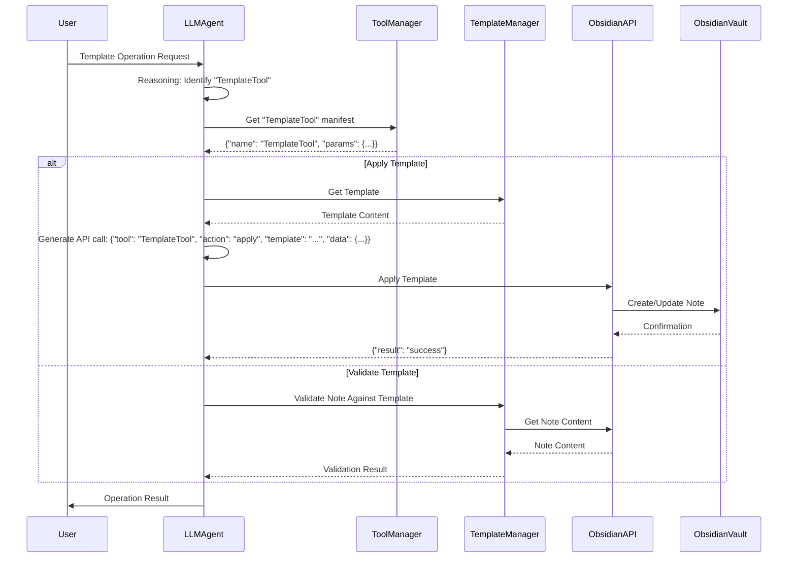
```mermaid
sequenceDiagram
    participant User
    participant LLMAgent
    participant ToolManager
    participant TemplateManager
    participant ObsidianAPI
    participant ObsidianVault
    
    User->>LLMAgent: Template Operation Request
    LLMAgent->>LLMAgent: Reasoning: Identify "TemplateTool"
    LLMAgent->>ToolManager: Get "TemplateTool" manifest
    ToolManager-->>LLMAgent: {"name": "TemplateTool", "params": {...}}
    
    alt Apply Template
        LLMAgent->>TemplateManager: Get Template
        TemplateManager-->>LLMAgent: Template Content
        LLMAgent->>LLMAgent: Generate API call: {"tool": "TemplateTool", "action": "apply", "template": "...", "data": {...}}
        LLMAgent->>ObsidianAPI: Apply Template
        ObsidianAPI->>ObsidianVault: Create/Update Note
        ObsidianVault-->>ObsidianAPI: Confirmation
        ObsidianAPI-->>LLMAgent: {"result": "success"}
    else Validate Template
        LLMAgent->>TemplateManager: Validate Note Against Template
        TemplateManager->>ObsidianAPI: Get Note Content
        ObsidianAPI-->>TemplateManager: Note Content
        TemplateManager-->>LLMAgent: Validation Result
    end
    
    LLMAgent->>User: Operation Result
```

### Flow 7: Tag Management Flow

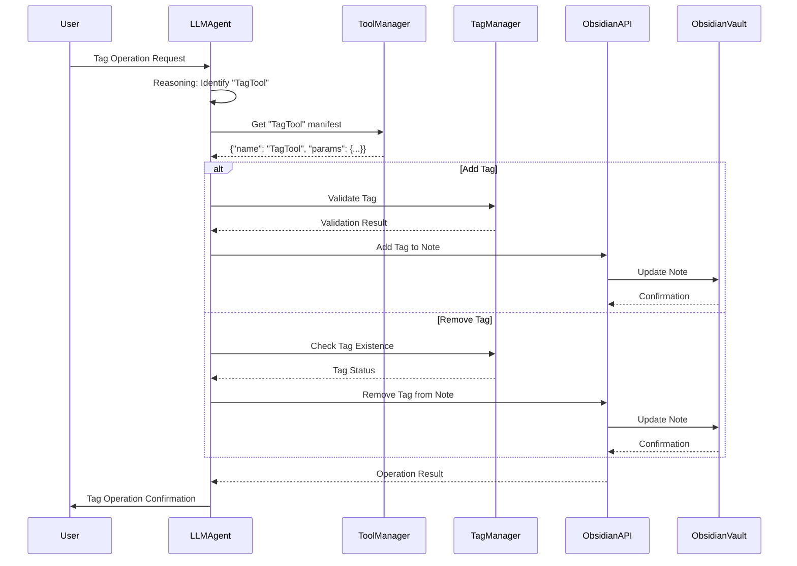
```mermaid
sequenceDiagram
    participant User
    participant LLMAgent
    participant ToolManager
    participant TagManager
    participant ObsidianAPI
    participant ObsidianVault
    
    User->>LLMAgent: Tag Operation Request
    LLMAgent->>LLMAgent: Reasoning: Identify "TagTool"
    LLMAgent->>ToolManager: Get "TagTool" manifest
    ToolManager-->>LLMAgent: {"name": "TagTool", "params": {...}}
    
    alt Add Tag
        LLMAgent->>TagManager: Validate Tag
        TagManager-->>LLMAgent: Validation Result
        LLMAgent->>ObsidianAPI: Add Tag to Note
        ObsidianAPI->>ObsidianVault: Update Note
        ObsidianVault-->>ObsidianAPI: Confirmation
    else Remove Tag
        LLMAgent->>TagManager: Check Tag Existence
        TagManager-->>LLMAgent: Tag Status
        LLMAgent->>ObsidianAPI: Remove Tag from Note
        ObsidianAPI->>ObsidianVault: Update Note
        ObsidianVault-->>ObsidianAPI: Confirmation
    end
    
    ObsidianAPI-->>LLMAgent: Operation Result
    LLMAgent->>User: Tag Operation Confirmation
```

### Flow 8: Content Processing Flow

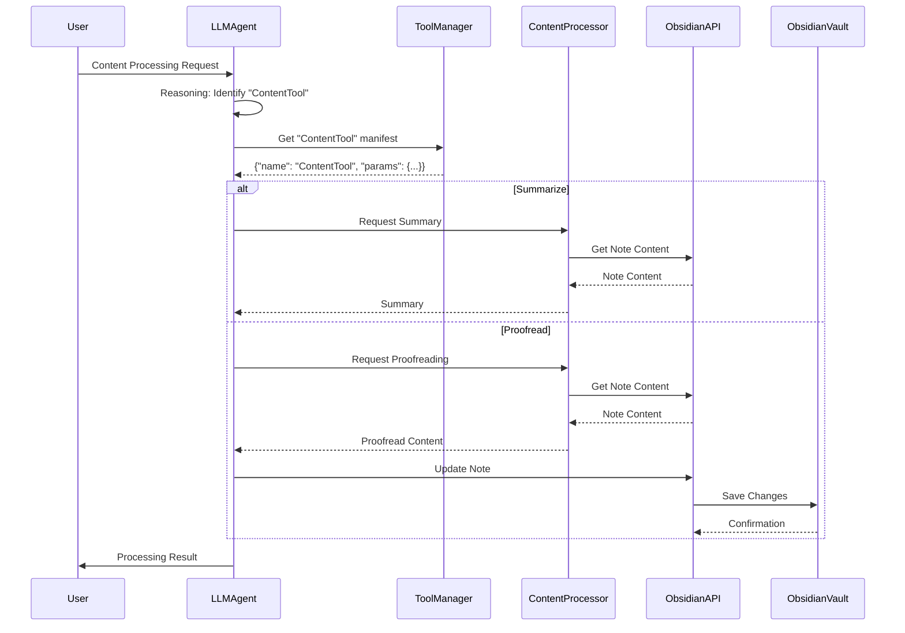
```mermaid
sequenceDiagram
    participant User
    participant LLMAgent
    participant ToolManager
    participant ContentProcessor
    participant ObsidianAPI
    participant ObsidianVault
    
    User->>LLMAgent: Content Processing Request
    LLMAgent->>LLMAgent: Reasoning: Identify "ContentTool"
    LLMAgent->>ToolManager: Get "ContentTool" manifest
    ToolManager-->>LLMAgent: {"name": "ContentTool", "params": {...}}
    
    alt Summarize
        LLMAgent->>ContentProcessor: Request Summary
        ContentProcessor->>ObsidianAPI: Get Note Content
        ObsidianAPI-->>ContentProcessor: Note Content
        ContentProcessor-->>LLMAgent: Summary
    else Proofread
        LLMAgent->>ContentProcessor: Request Proofreading
        ContentProcessor->>ObsidianAPI: Get Note Content
        ObsidianAPI-->>ContentProcessor: Note Content
        ContentProcessor-->>LLMAgent: Proofread Content
        LLMAgent->>ObsidianAPI: Update Note
        ObsidianAPI->>ObsidianVault: Save Changes
        ObsidianVault-->>ObsidianAPI: Confirmation
    end
    
    LLMAgent->>User: Processing Result
```

## Integrated Subsystem Flows

### RAG Query Integration Flow

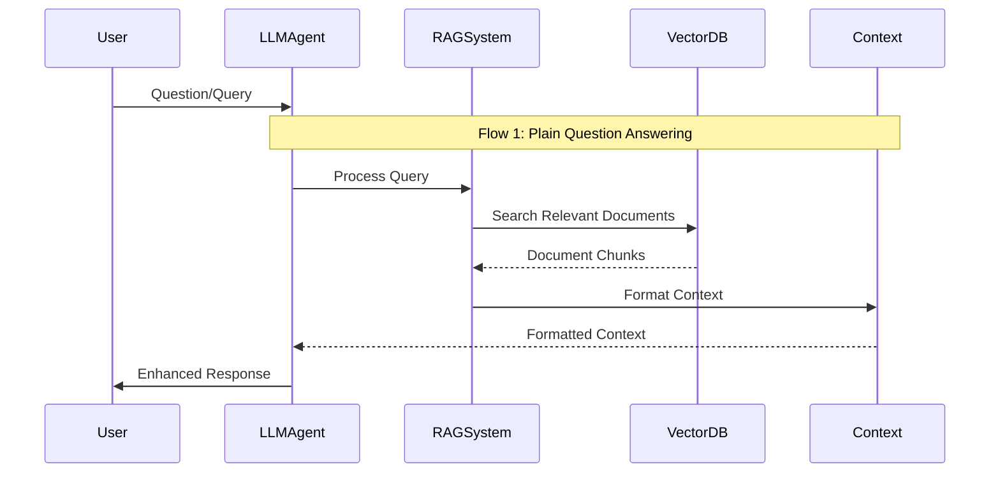
```mermaid
sequenceDiagram
    participant User
    participant LLMAgent
    participant RAGSystem
    participant VectorDB
    participant Context

    User->>LLMAgent: Question/Query
    Note over LLMAgent,Context: Flow 1: Plain Question Answering
    LLMAgent->>RAGSystem: Process Query
    RAGSystem->>VectorDB: Search Relevant Documents
    VectorDB-->>RAGSystem: Document Chunks
    RAGSystem->>Context: Format Context
    Context-->>LLMAgent: Formatted Context
    LLMAgent->>User: Enhanced Response
```

### Note Management Integration Flow

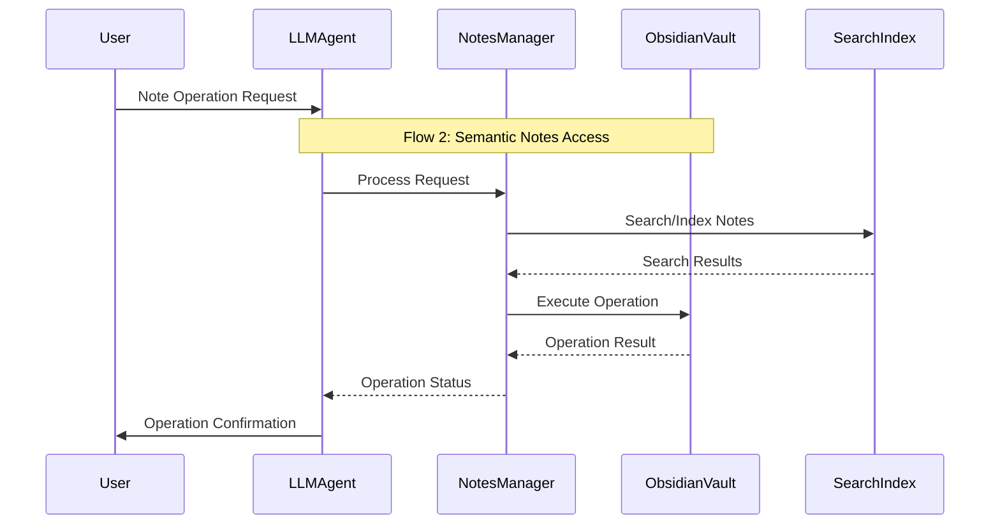
```mermaid
sequenceDiagram
    participant User
    participant LLMAgent
    participant NotesManager
    participant ObsidianVault
    participant SearchIndex

    User->>LLMAgent: Note Operation Request
    Note over LLMAgent,ObsidianVault: Flow 2: Semantic Notes Access
    LLMAgent->>NotesManager: Process Request
    NotesManager->>SearchIndex: Search/Index Notes
    SearchIndex-->>NotesManager: Search Results
    NotesManager->>ObsidianVault: Execute Operation
    ObsidianVault-->>NotesManager: Operation Result
    NotesManager-->>LLMAgent: Operation Status
    LLMAgent->>User: Operation Confirmation
```

### Knowledge Enhancement Integration Flow

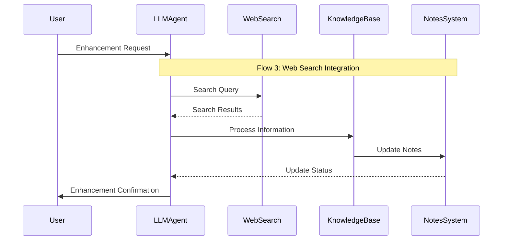
```mermaid
sequenceDiagram
    participant User
    participant LLMAgent
    participant WebSearch
    participant KnowledgeBase
    participant NotesSystem

    User->>LLMAgent: Enhancement Request
    Note over LLMAgent,NotesSystem: Flow 3: Web Search Integration
    LLMAgent->>WebSearch: Search Query
    WebSearch-->>LLMAgent: Search Results
    LLMAgent->>KnowledgeBase: Process Information
    KnowledgeBase->>NotesSystem: Update Notes
    NotesSystem-->>LLMAgent: Update Status
    LLMAgent->>User: Enhancement Confirmation
```

### Vault Organization Integration Flow

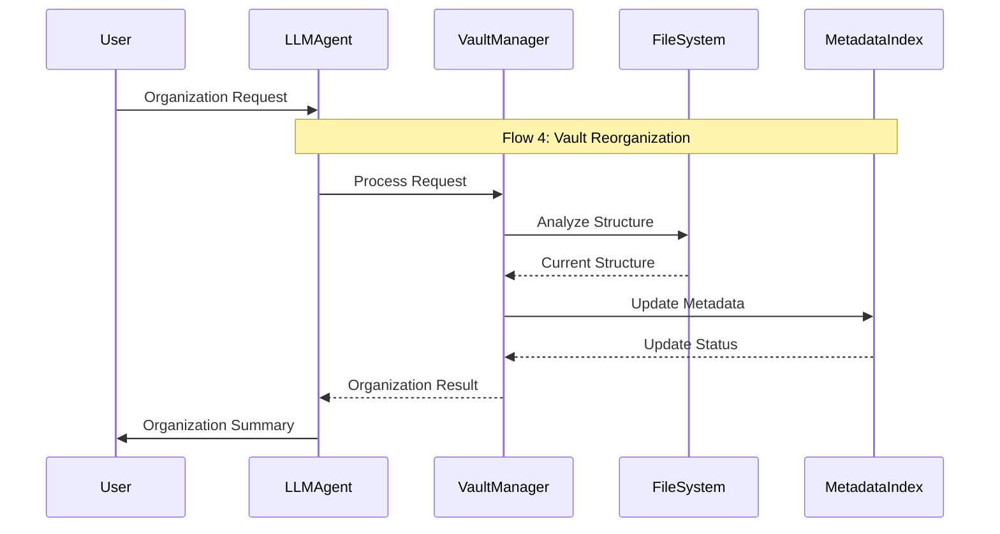
```mermaid
sequenceDiagram
    participant User
    participant LLMAgent
    participant VaultManager
    participant FileSystem
    participant MetadataIndex

    User->>LLMAgent: Organization Request
    Note over LLMAgent,MetadataIndex: Flow 4: Vault Reorganization
    LLMAgent->>VaultManager: Process Request
    VaultManager->>FileSystem: Analyze Structure
    FileSystem-->>VaultManager: Current Structure
    VaultManager->>MetadataIndex: Update Metadata
    MetadataIndex-->>VaultManager: Update Status
    VaultManager-->>LLMAgent: Organization Result
    LLMAgent->>User: Organization Summary
```

### Service Integration Flow

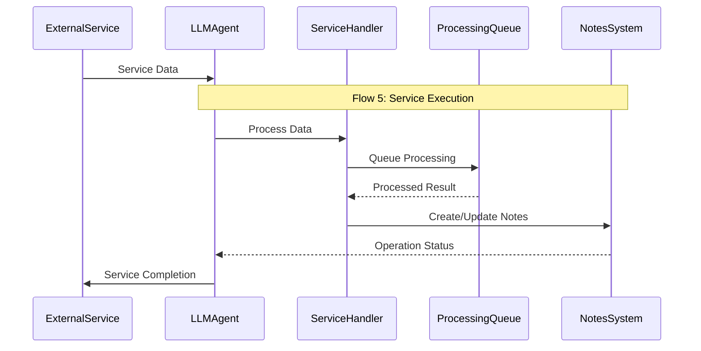
```mermaid
sequenceDiagram
    participant ExternalService
    participant LLMAgent
    participant ServiceHandler
    participant ProcessingQueue
    participant NotesSystem

    ExternalService->>LLMAgent: Service Data
    Note over LLMAgent,NotesSystem: Flow 5: Service Execution
    LLMAgent->>ServiceHandler: Process Data
    ServiceHandler->>ProcessingQueue: Queue Processing
    ProcessingQueue-->>ServiceHandler: Processed Result
    ServiceHandler->>NotesSystem: Create/Update Notes
    NotesSystem-->>LLMAgent: Operation Status
    LLMAgent->>ExternalService: Service Completion
```

### Configuration Management Integration Flow

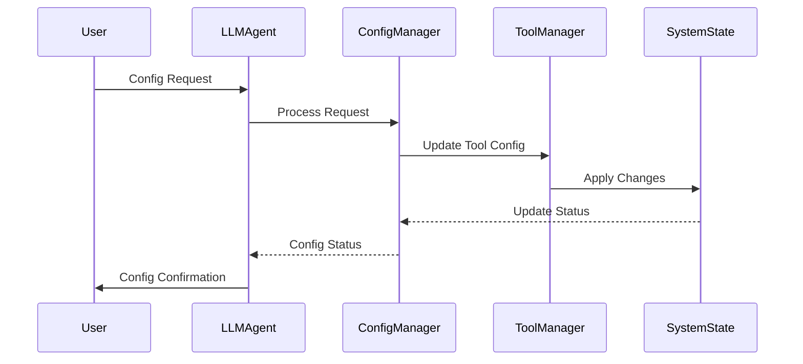
```mermaid
sequenceDiagram
    participant User
    participant LLMAgent
    participant ConfigManager
    participant ToolManager
    participant SystemState

    User->>LLMAgent: Config Request
    LLMAgent->>ConfigManager: Process Request
    ConfigManager->>ToolManager: Update Tool Config
    ToolManager->>SystemState: Apply Changes
    SystemState-->>ConfigManager: Update Status
    ConfigManager-->>LLMAgent: Config Status
    LLMAgent->>User: Config Confirmation
```

### Error Handling Integration Flow

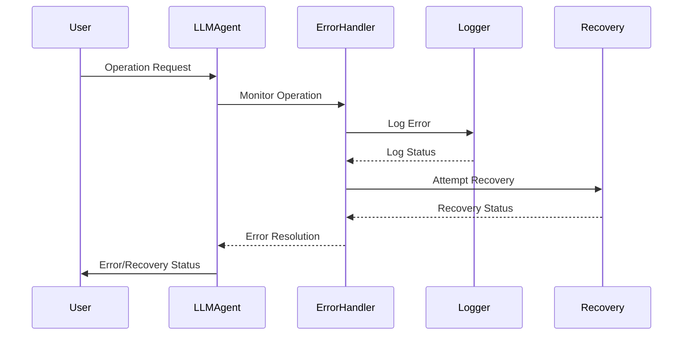
```mermaid
sequenceDiagram
    participant User
    participant LLMAgent
    participant ErrorHandler
    participant Logger
    participant Recovery

    User->>LLMAgent: Operation Request
    LLMAgent->>ErrorHandler: Monitor Operation
    ErrorHandler->>Logger: Log Error
    Logger-->>ErrorHandler: Log Status
    ErrorHandler->>Recovery: Attempt Recovery
    Recovery-->>ErrorHandler: Recovery Status
    ErrorHandler-->>LLMAgent: Error Resolution
    LLMAgent->>User: Error/Recovery Status
```

### Plugin Integration Flow

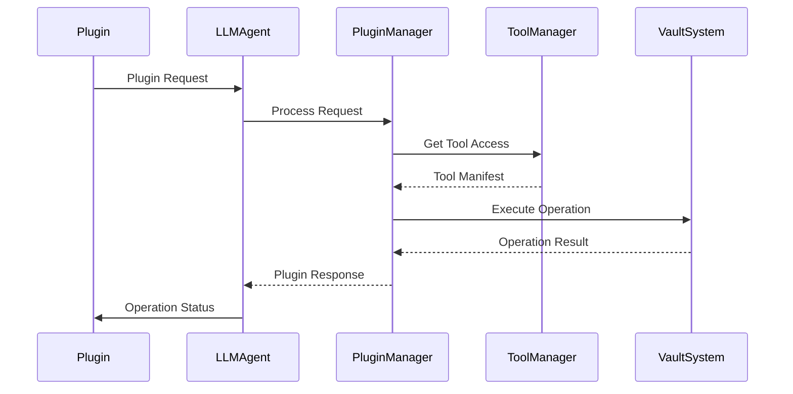
```mermaid
sequenceDiagram
    participant Plugin
    participant LLMAgent
    participant PluginManager
    participant ToolManager
    participant VaultSystem

    Plugin->>LLMAgent: Plugin Request
    LLMAgent->>PluginManager: Process Request
    PluginManager->>ToolManager: Get Tool Access
    ToolManager-->>PluginManager: Tool Manifest
    PluginManager->>VaultSystem: Execute Operation
    VaultSystem-->>PluginManager: Operation Result
    PluginManager-->>LLMAgent: Plugin Response
    LLMAgent->>Plugin: Operation Status
```

### Search and Discovery Integration Flow

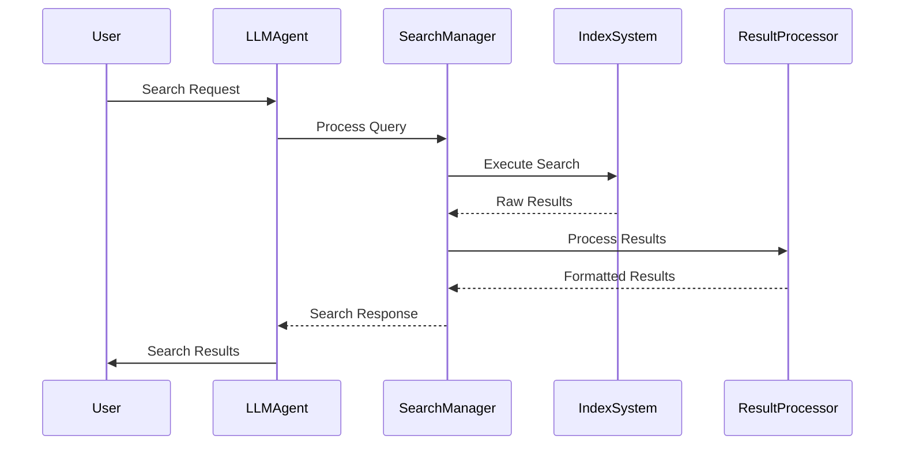
```mermaid
sequenceDiagram
    participant User
    participant LLMAgent
    participant SearchManager
    participant IndexSystem
    participant ResultProcessor

    User->>LLMAgent: Search Request
    LLMAgent->>SearchManager: Process Query
    SearchManager->>IndexSystem: Execute Search
    IndexSystem-->>SearchManager: Raw Results
    SearchManager->>ResultProcessor: Process Results
    ResultProcessor-->>SearchManager: Formatted Results
    SearchManager-->>LLMAgent: Search Response
    LLMAgent->>User: Search Results
```

### Task Management Integration Flow

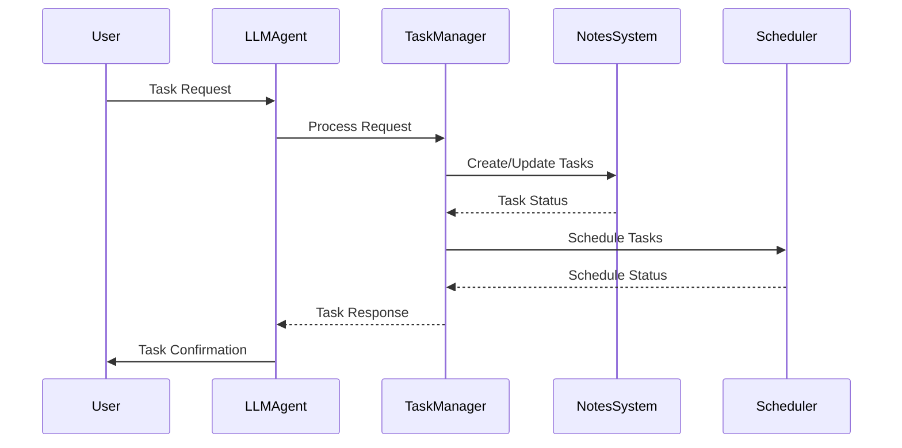
```mermaid
sequenceDiagram
    participant User
    participant LLMAgent
    participant TaskManager
    participant NotesSystem
    participant Scheduler

    User->>LLMAgent: Task Request
    LLMAgent->>TaskManager: Process Request
    TaskManager->>NotesSystem: Create/Update Tasks
    NotesSystem-->>TaskManager: Task Status
    TaskManager->>Scheduler: Schedule Tasks
    Scheduler-->>TaskManager: Schedule Status
    TaskManager-->>LLMAgent: Task Response
    LLMAgent->>User: Task Confirmation
```

### Backup and Recovery Integration Flow

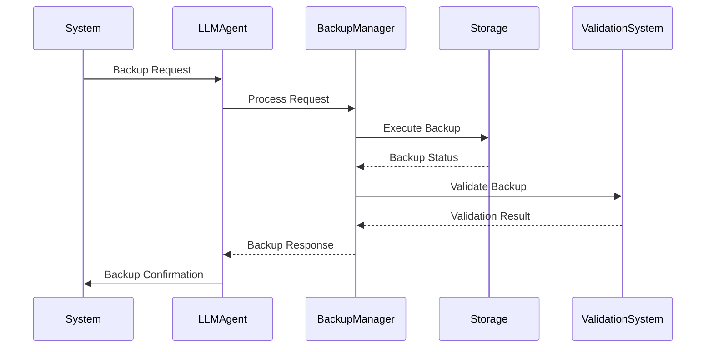
```mermaid
sequenceDiagram
    participant System
    participant LLMAgent
    participant BackupManager
    participant Storage
    participant ValidationSystem

    System->>LLMAgent: Backup Request
    LLMAgent->>BackupManager: Process Request
    BackupManager->>Storage: Execute Backup
    Storage-->>BackupManager: Backup Status
    BackupManager->>ValidationSystem: Validate Backup
    ValidationSystem-->>BackupManager: Validation Result
    BackupManager-->>LLMAgent: Backup Response
    LLMAgent->>System: Backup Confirmation
```

### Configuration Management and Indexing Flow

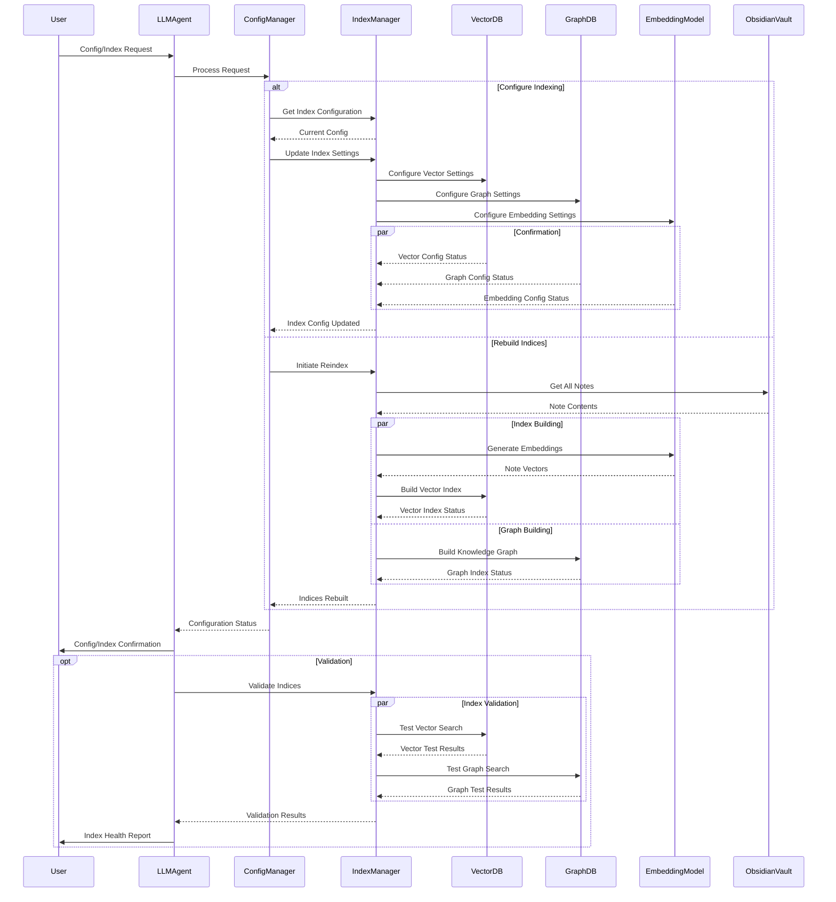
```mermaid
sequenceDiagram
    participant User
    participant LLMAgent
    participant ConfigManager
    participant IndexManager
    participant VectorDB
    participant GraphDB
    participant EmbeddingModel
    participant ObsidianVault
    
    User->>LLMAgent: Config/Index Request
    LLMAgent->>ConfigManager: Process Request
    
    alt Configure Indexing
        ConfigManager->>IndexManager: Get Index Configuration
        IndexManager-->>ConfigManager: Current Config
        ConfigManager->>IndexManager: Update Index Settings
        IndexManager->>VectorDB: Configure Vector Settings
        IndexManager->>GraphDB: Configure Graph Settings
        IndexManager->>EmbeddingModel: Configure Embedding Settings
        
        par Confirmation
            VectorDB-->>IndexManager: Vector Config Status
            GraphDB-->>IndexManager: Graph Config Status
            EmbeddingModel-->>IndexManager: Embedding Config Status
        end
        
        IndexManager-->>ConfigManager: Index Config Updated
    else Rebuild Indices
        ConfigManager->>IndexManager: Initiate Reindex
        IndexManager->>ObsidianVault: Get All Notes
        ObsidianVault-->>IndexManager: Note Contents
        
        par Index Building
            IndexManager->>EmbeddingModel: Generate Embeddings
            EmbeddingModel-->>IndexManager: Note Vectors
            IndexManager->>VectorDB: Build Vector Index
            VectorDB-->>IndexManager: Vector Index Status
        and Graph Building
            IndexManager->>GraphDB: Build Knowledge Graph
            GraphDB-->>IndexManager: Graph Index Status
        end
        
        IndexManager-->>ConfigManager: Indices Rebuilt
    end
    
    ConfigManager-->>LLMAgent: Configuration Status
    LLMAgent->>User: Config/Index Confirmation
    
    opt Validation
        LLMAgent->>IndexManager: Validate Indices
        par Index Validation
            IndexManager->>VectorDB: Test Vector Search
            VectorDB-->>IndexManager: Vector Test Results
            IndexManager->>GraphDB: Test Graph Search
            GraphDB-->>IndexManager: Graph Test Results
        end
        IndexManager-->>LLMAgent: Validation Results
        LLMAgent->>User: Index Health Report
    end
``` 